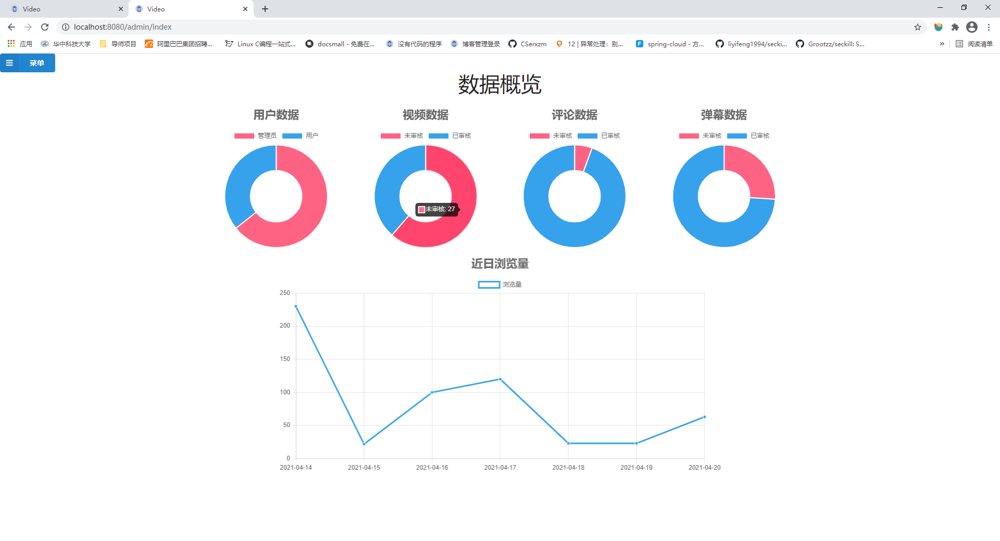
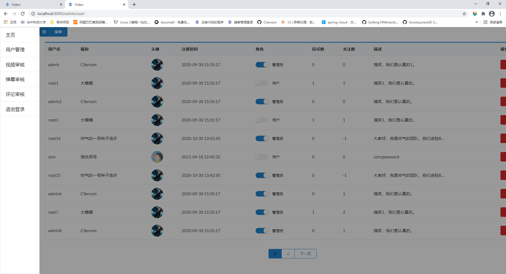
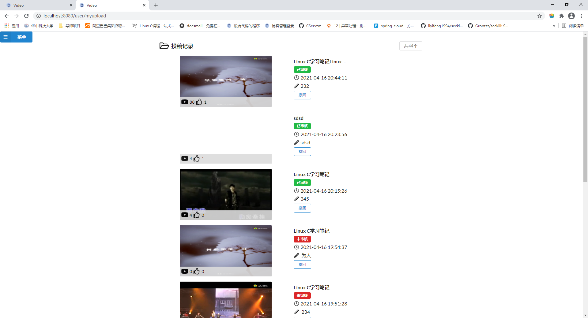

# video

此项目是一个模仿某站的视频网站，其中包括视频的上创，封面的截取；
视频的收藏以及作者的关注，对于优秀的视频可以点赞、收藏以及投币。

正在完善中。。。
### 涉及的技术
* Spring
* Spring mvc
* Mybatis (包括自动生成工具)
* Redis 实现近日的浏览量的存储，以及热点数据的存储
* shiro
* Liquibase(数据库重构工具)
* 自定义的注解，实现读写锁,和缓存的使用
* semantic ui + thymeleaf 前端

### 部署
首先要开启mysql，和redis。导入sql文件夹中sql文件，用户名为admin，密码为123456。
其中在类路径下添加`jdbc.properties`文件,用于数据的配置。
```properties
jdbc.username=root
jdbc.password=*******#改成自己的密码
jdbc.driverClass=com.mysql.jdbc.Driver
jdbc.url=jdbc:mysql://localhost:3306/video?useUnicode=true&characterEncoding=UTF-8&serverTimezone=UTC

redis.hostname=127.0.0.1
redis.port=6379
redis.database=0
redis.pass=******#改成自己的密码
redis.pool.maxActive=50
redis.pool.maxIdle=300
redis.pool.maxTotal=600
redis.pool.maxWaitMillis=20000
```

### 效果图








### 问题

* 对于开始图片视频没有显示，因为你本地路径下没有该封面文件和视频文件，你可以投稿，自己上传视频，后拖动进度条，选择封面。
* 不能点击收藏、投币、点赞。该应用提供的是登陆后才能进行相关操作。
