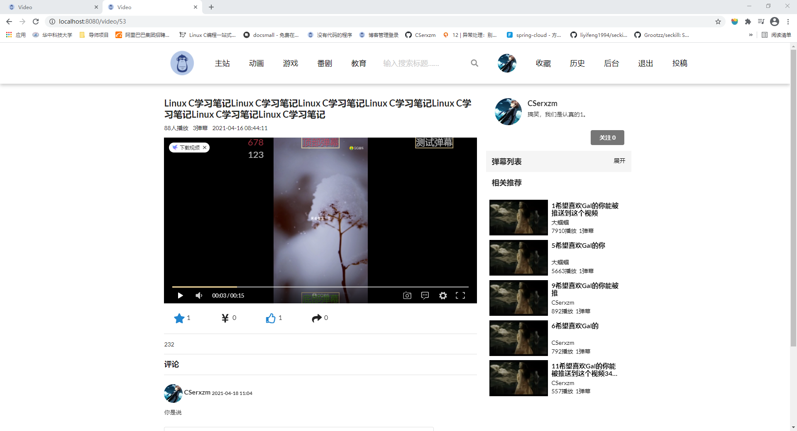

# video

此项目是一个模仿某站的视频网站，其中包括视频的上创，封面的截取；
视频的收藏以及作者的关注，对于优秀的视频可以点赞、收藏以及投币。

正在完善中。。。
### 涉及的技术
* Spring
* Spring mvc
* Mybatis (包括自动生成工具)
* shiro
* Liquibase(数据库重构工具)
* 自定义的注解，实现读写锁
* semantic ui + thymeleaf 前端

### 效果图

